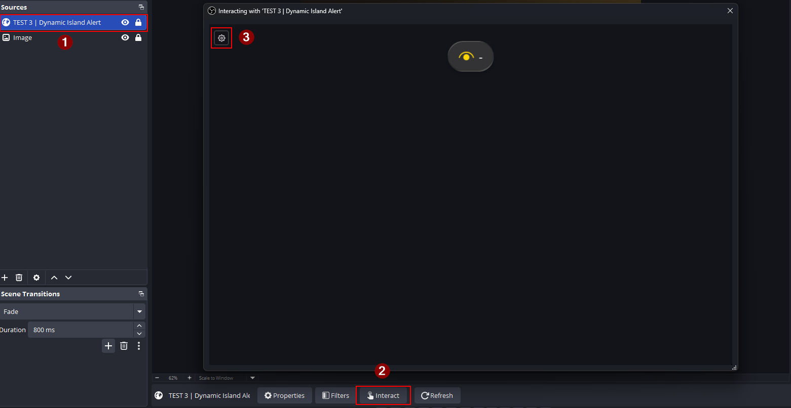
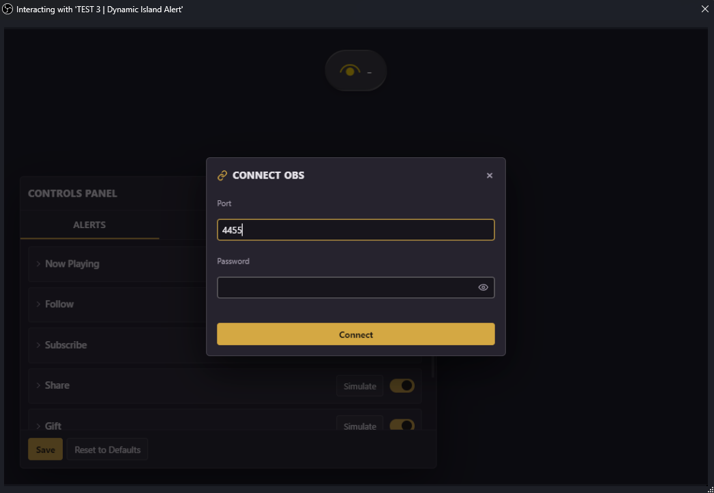

## Kebutuhan

- **OBS Studio 30+** dengan **obs-websocket** bawaan yang aktif.
- Koneksi live TikTok lewat **TikFinity** atau **IndoFinity**, pilih yang kamu pakai untuk mengirim event.
- Now Playing lewat SMTC bridge (https://github.com/nuttylmao/smtc-bridge)

---

## Instalasi

Semua diatur dari **Controls Panel** yang terbuka di atas overlay itu sendiri,
jadi kamu mengatur alert sambil melihat hasilnya. Tanpa dashboard terpisah dan
tanpa URL panjang. Tambahkan sumber **Browser** ke scene tempat alert ingin
ditampilkan dan pakai URL ini:

| Field | Value |
|---|---|
| URL | https://sekisungkarak.web.id/dynamic-island-alert/ |

Lalu pilih sumbernya, klik **Interact** dan tekan **S**, atau klik tombol gear
kecil yang muncul di pojok kiri atas saat kamu menggerakkan mouse (tidak pernah
ikut terekam di stream), untuk membuka panel. Saat pertama kali dijalankan,
dialog **Connect OBS** terbuka sendiri: isi **Port** (default `4455`) dan
**Password** dari **Tools → WebSocket Server Settings**, lalu tekan **Connect**.
Titiknya berubah hijau begitu overlay tersambung ke OBS. Kamu bisa menyeret
panel lewat bar judulnya untuk memindahkan, dan klik dua kali bar judul untuk
mengembalikannya ke pojok kiri bawah.

> [!WARNING]
> **Satu widget per scene**: cukup satu widget di tiap scene, dan nyalakan suara
> notifikasi hanya di satu source saja supaya suaranya tidak bentrok.

---

## Alternatif: dock dashboard

Kalau kamu lebih suka mengatur semuanya lewat dock di dalam OBS, dashboard lama
tetap bisa dipakai dan membaca profil tersimpan yang sama dengan panel, jadi
kamu bisa berpindah di antara keduanya kapan saja tanpa kehilangan apa pun.
Tambahkan lewat **Docks → Custom Browser Docks** dengan URL ini:

| Field | Value |
|---|---|
| URL | https://sekisungkarak.web.id/dynamic-island-alert/dashboard/ |
