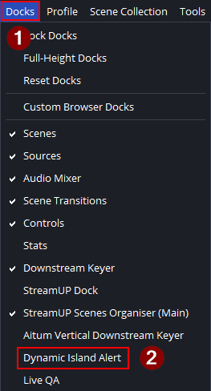
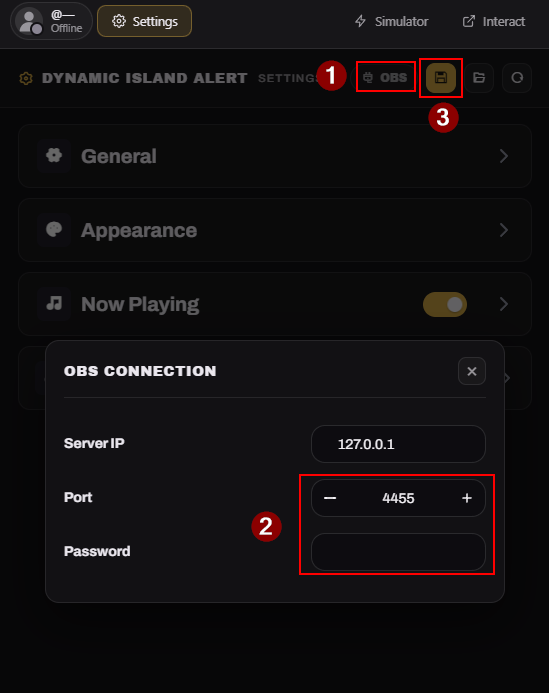
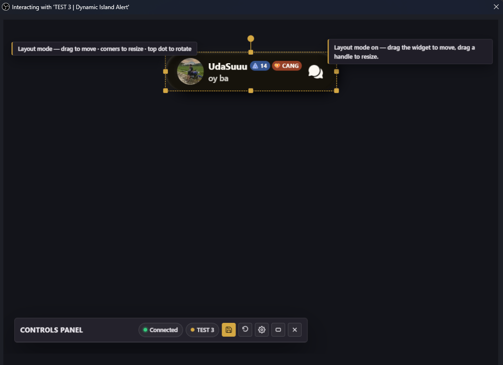

## Kebutuhan

- **OBS Studio 30+** dengan **obs-websocket** bawaan yang aktif.
- **Geseki Bridge** untuk koneksi live TikTok dan Now Playing, [unduh](https://github.com/sekisungkarak/geseki-bridge/releases).

---

## Instalasi

Semua diatur dari dock **Dynamic Island Alert** yang ditambahkan Geseki Bridge
ke OBS. Buka **Docks** di menu bar lalu aktifkan.

Di dock-nya, isi kartu **OBS Connection**: **Server IP** dan **Port** (default
`4455`), plus **Password** kalau kamu memasangnya di **Tools → WebSocket
Server Settings**, lalu tekan **Save**. Menekan Save otomatis menambahkan widget
ke scene yang sedang aktif, overlay langsung muncul di stream, tanpa perlu
menambah sumber Browser sendiri. Titik statusnya berubah hijau begitu widget
tersambung ke OBS.

---

## Kustomisasi

Semua diatur dari dock **Dynamic Island Alert**, pada tab **Settings**.
Opsinya dikelompokkan ke dalam kartu (**General**, **Appearance**, **Now
Playing**, **TikTok Alerts**); header menyimpan **Save**, **Load**, dan
**Reset**, dan pil di atas menampilkan status koneksi TikTok. **Simulator**
mengirim event uji supaya kamu bisa melihat pratinjau alert tanpa chat
sungguhan, dan **Interact** membuka dialog Interact overlay di OBS.

