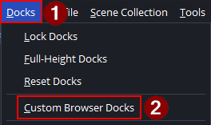
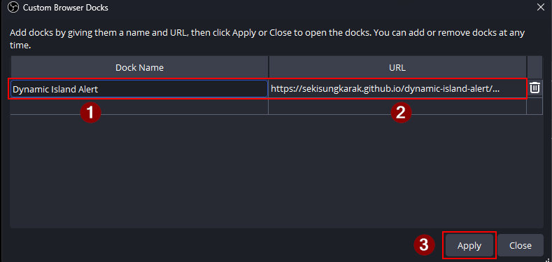
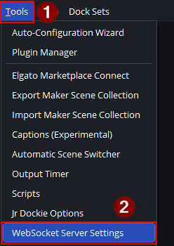
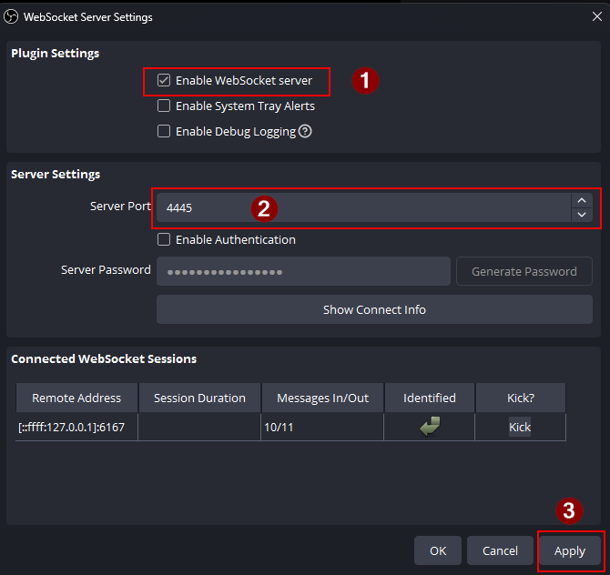
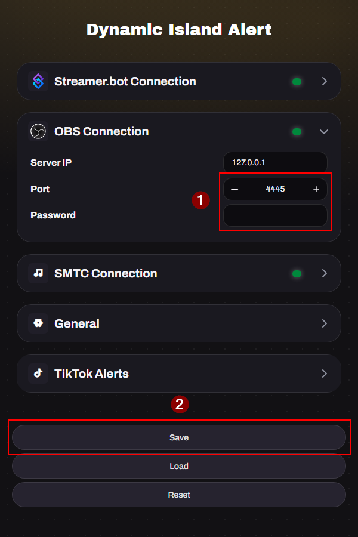
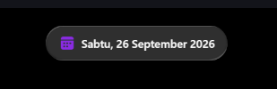
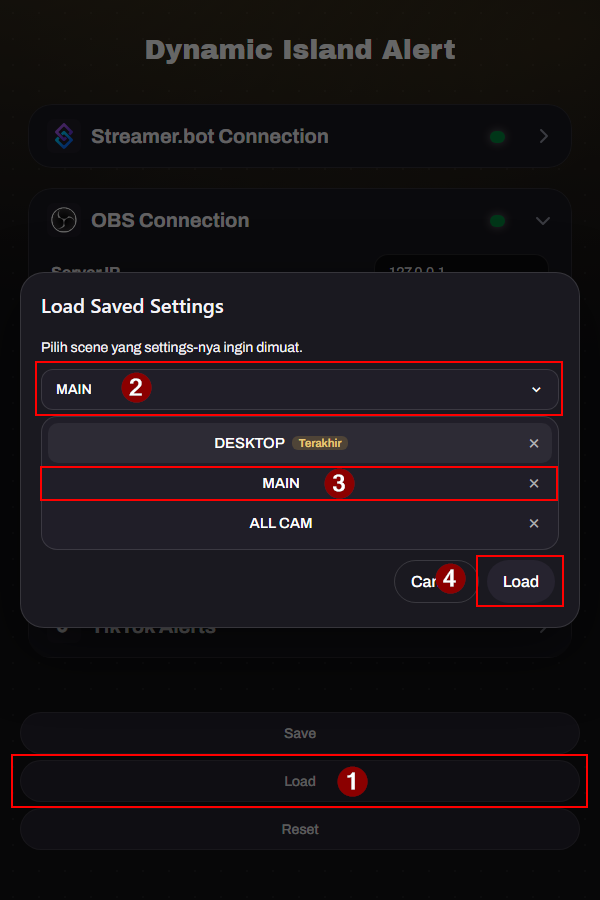

## Requirements

- **OBS Studio 30+** with the built-in **obs-websocket** enabled.
- A TikTok live connection via **TikFinity** or **IndoFinity** — whichever you use to feed events.
- Now Playing via SMTC bridge (https://github.com/nuttylmao/smtc-bridge)

---

## Installation

Everything is configured from a **Controls Panel** that opens on top of the
overlay itself. You add one browser source, press **S**, and tune the alert
while looking at it. No separate dashboard, no long URL.

### Step 1 — Add the browser source

1. In OBS, add a new **Browser** source to the scene you want the alert in.
2. Set the URL to:

   ```
   https://sekisungkarak.web.id/dynamic-island-alert/
   ```

3. Set **Width** and **Height** to your OBS canvas size — `1920x1080` for most
   people — and tick **Shutdown source when not visible** off if you want the
   connection to stay alive between scenes.

### Step 2 — Open the Controls Panel

Select the browser source and click **Interact**. Then press **S** — or click the small gear button that appears in the top-left corner while you move your mouse. Use the gear if the S key does not reach the overlay in your OBS build. The button only shows up while you are interacting, so it never appears on stream.

The Controls Panel opens on top of your canvas. **Drag its title bar to move it anywhere** — the position is remembered, and a double-click on the title bar returns it to the top-left corner. The panel is a fixed 640px wide (just like Better Alerts) and the backdrop is transparent, so the overlay behind it stays visible. **Options → Panel Layout → Reset Layout** (or a double-click on the title bar) restores the default position. Its tabs are **Alerts**, **General**, **Connections** and **Options** — the
alert cards and **Now Playing** are under Alerts.

> **Tip** — you can also open the overlay in a normal browser tab
> (`https://sekisungkarak.web.id/dynamic-island-alert/?controls=1`) to
> configure it comfortably on a big screen. Your settings live in the overlay's
> own storage, so anything you set there is already in place when OBS loads it.

### Step 3 — Fill in the connections

Open the **OBS Connection** group and enter the values of your **own** OBS
WebSocket server:

| Field | Value |
|---|---|
| **Server IP** | `127.0.0.1` |
| **Port** | the **Server Port** from **Tools → WebSocket Server Settings** (default `4455`) |
| **Password** | the password from the same dialog (leave empty if disabled) |

The status dot turns **green** once the overlay connects to OBS. If it stays
red, the port or password does not match — fix it here before continuing.

Do the same for **Streamer.bot Connection** and **TikTok Connection** for the
features you use. **Now Playing** lives in the **Alerts** tab, next to the alert
cards.

### Step 4 — Save and apply

Press **Save & Apply** at the bottom of the panel. The overlay reloads with your
settings and keeps them — you never have to touch the URL again.


### Step 5 — Done

Adjust any alert type you like and press **Save & Apply** again. Everything is
stored inside the browser source's own storage, so clearing the OBS browser
cache or moving the source to another scene changes nothing.

> **Profiles** — one browser source can hold several setups. Use the dropdown at
> the top of the panel to switch, **+ Profil** to create one and **Hapus** to
> delete it. To pin a source to a specific profile, add `?profile=Name` to its
> URL, for example `https://sekisungkarak.web.id/dynamic-island-alert/?profile=Gameplay`.

---

## Alternative — the dashboard dock

If you would rather configure everything in a dock inside OBS, the older
dashboard still works and can be used side by side with the panel.

### Step 1 — Add the dashboard dock

1. In OBS, open the top menu **Docks → Custom Browser Docks**.
2. In the dialog, add one row:

   | Field | Value |
   |---|---|
   | **Dock Name** | `Dynamic Island Alert` |
   | **URL** | `https://sekisungkarak.web.id/dynamic-island-alert/dashboard/` |

3. Click **Apply**, then **Close**. The dashboard appears as a dock inside OBS.





### Step 2 — Check the OBS WebSocket port

The dashboard talks to OBS over **obs-websocket**, so the port must match on both
sides.

1. In OBS, open **Tools → WebSocket Server Settings**.
2. Make sure **Enable WebSocket server** is checked, and note the **Server Port**.
3. Click **Apply** to save.





### Step 3 — Fill in the OBS Connection and Press Save

In the dock, open the **OBS Connection** section and enter the values of your
**own** OBS WebSocket server — the **Port** must be the same number you noted in
Step 2:

| Field | Value |
|---|---|
| **Server IP** | `127.0.0.1` |
| **Port** | the same **Server Port** as in Step 2 (default `4455`) |
| **Password** | the password from the same OBS dialog (leave empty if disabled) |

The status dot turns **green** once the dock connects to OBS. If it stays red,
the port or password does not match your OBS WebSocket settings — fix it here
before continuing.

Click **Save** at the bottom of the dock. The dashboard then creates a **Browser
Source** in the **currently active scene**.





> **Tip** — switch to the scene you want the alert in **before** pressing Save,
> and add it to each scene you stream.

### Step 4 — Load saved settings

**Load** pulls a saved configuration back into the dock for a chosen scene.

1. Click **Load** at the bottom of the dock.
2. In the **Load Saved Settings** dialog, pick the **Scene** whose settings you
   want to load.
3. Click **Load**.



Use **Reset** to return every option to its defaults.

> The dock and the Controls Panel read and write the **same** saved profiles, so
> you can switch between them at any time without losing anything.
