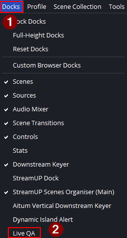
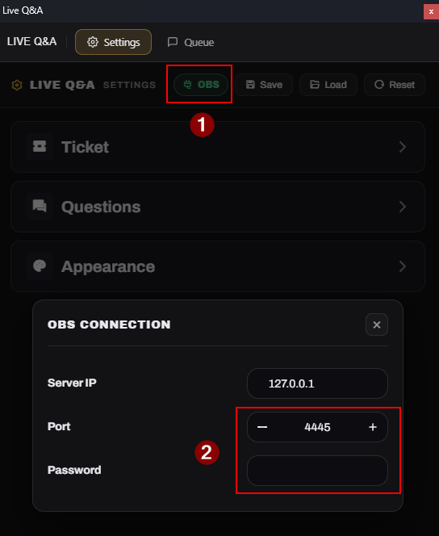
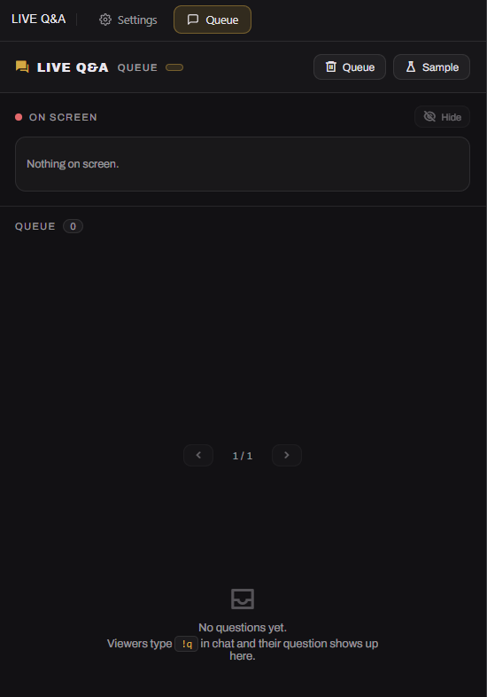

## Kebutuhan

- **OBS Studio 30+** dengan **obs-websocket** bawaan dalam keadaan aktif.
- **Geseki Bridge** untuk koneksi live TikTok — [unduh](https://github.com/sekisungkarak/geseki-bridge/releases).

---

## Pemasangan

Semua diatur dari dock **Live Q&A** yang ditambahkan Geseki Bridge ke OBS. Buka
**Docks** di menu bar lalu aktifkan.

Di dock-nya, buka **OBS Connection**, isi **Server IP** dan **Port** (default
`4455`), plus **Password** kalau kamu memasangnya di **Tools → WebSocket Server
Settings**, lalu tekan **Save**. Menekan Save otomatis menambahkan widget ke
scene yang sedang aktif — overlay langsung muncul di stream, tanpa perlu
menambah sumber Browser sendiri. Titik statusnya berubah hijau begitu widget
tersambung ke OBS.

---

## Queue

Penonton bertanya lewat chat; kamu mengatur pertanyaannya dari tab **Queue**.

Tentukan **Question Prefix** (bawaan `!q`) di bagian **Questions** pada dock.
Pesan chat yang diawali prefix ini menjadi pertanyaan dan masuk ke antrean —
belum ada yang tampil di layar.

Klik satu pertanyaan di antrean untuk menampilkannya; overlay menampilkan satu
pertanyaan sekaligus. Pakai **Next** dan **Previous** untuk berpindah, dan
**Hide** untuk mengangkat pertanyaan dari layar.

Untuk menguji tanpa chat sungguhan, tekan **Sample** untuk menambah pertanyaan
lorem ipsum. Lencana di tab **Queue** menghitung berapa pertanyaan yang menunggu,
dan pertanyaan yang sudah pernah tampil tetap ada di daftar dengan tanda `shown`
supaya bisa ditampilkan lagi.

Untuk mewajibkan gift sebelum seseorang bertanya, pilih **Ticket Gift**: penonton
harus mengirim gift itu dulu, dan satu gift berlaku untuk satu pertanyaan.
Biarkan kosong dan siapa pun boleh bertanya hanya dengan prefix.

> [!NOTE]
> Widget ini tidak memakai fitur Q&A bawaan TikTok. Fitur itu harus diaktifkan
> oleh streamer dan event-nya belum tentu terkirim, jadi alurnya dibangun
> sepenuhnya dari `gift` dan `chat`.
